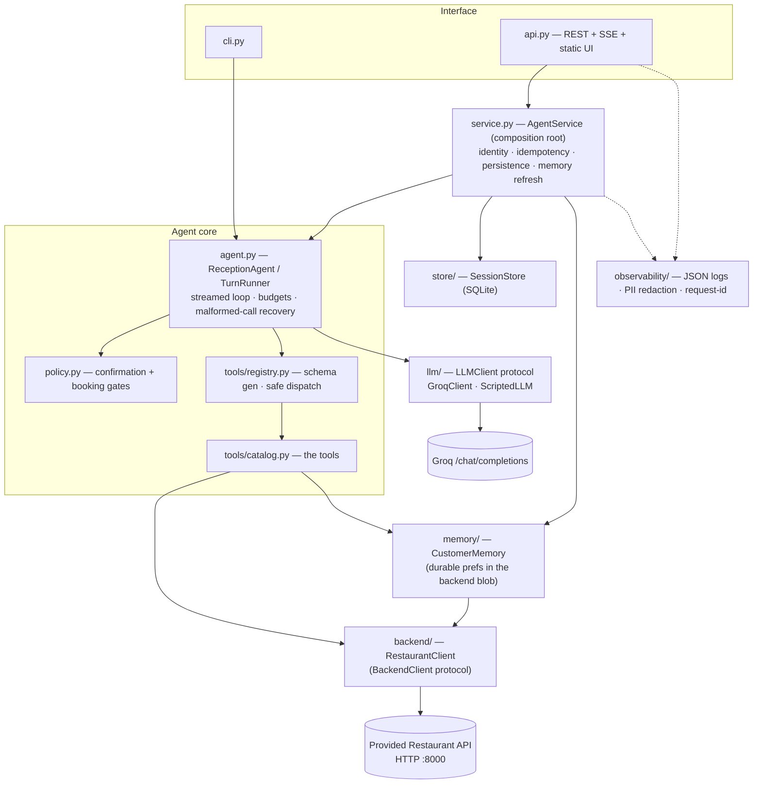
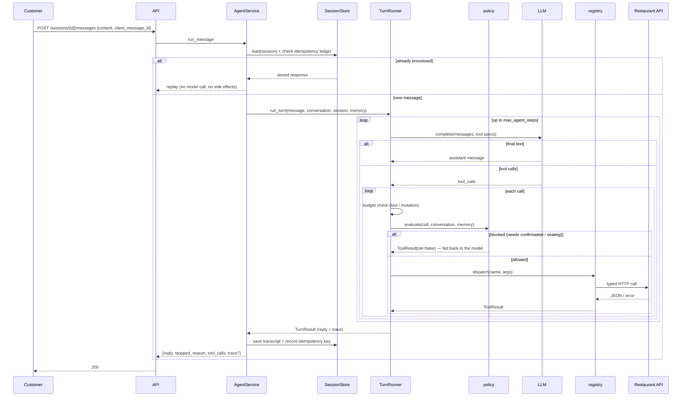

# Architecture

A hand-rolled agent harness around a chat model, with production concerns
(persistence, guardrails, observability, streaming) layered on top - not a
framework. The distinctive parts are the **inspectable loop**, the
**provider-agnostic LLM seam**, the **decorator tool registry**, and a
**deterministic policy layer** in front of tool execution.

## Layers

Each layer depends only on the one below and never skips it. `agent.py` knows
nothing about HTTP or Groq; `tools/` knows nothing about the model wire format;
`backend/` knows nothing about tools. Swapping the model provider, the interface,
or the backend transport is a one-file change behind a Protocol.

## One turn

The SSE endpoint runs the identical `TurnRunner`, forwarding each
`tool_call` / `tool_result` / `notice` / `message` / `done` event as it happens.

## Key mechanisms

### Tool layer — defensive by construction
`ToolRegistry.dispatch` is the trust boundary. It never raises; every failure mode
becomes a `ToolResult(ok=False, error_code=...)`:

| Failure | `error_code` |
|---|---|
| hallucinated tool name | `unknown_tool` |
| arguments not valid JSON | `bad_json` |
| arguments wrong shape (Pydantic) | `bad_arguments` |
| unparseable date/time | `bad_datetime` |
| acting on someone else's reservation | `ownership_denied` |
| upstream 4xx / 5xx | `upstream_error` / `upstream_unavailable` |
| anything unexpected in the tool | `internal_error` |
| provider rejected the model's own tool call | `MalformedToolCall` → loop feeds the reason back and retries |

Adding a tool is one function + one Pydantic args model in `catalog.py`; the
schema, validation, error shaping, and the mutation/destructive classifications
follow from `@registry.register`.

### Policy layer — deterministic guardrails (`policy.py`)
Pure functions of `(tool call, conversation, memory)`, unit-tested with no LLM:
* **confirmation** — `cancel_reservation` / `remove_order_item` are blocked until
  the customer explicitly asks or confirms. The block is returned to the model as
  a tool result, so it produces a natural "are you sure?" turn; the customer's
  "yes" clears the gate next turn.
* **booking precondition** — `book_table` is blocked until seating is resolved
  (explicit choice in the conversation, or a stored preference). New guests are
  asked once; returning guests sail through.

### Budgets (`agent.py`)
Three independent caps, each with its own `stopped_reason`: `max_agent_steps`
(LLM rounds), `max_tool_calls`, `max_mutations`. A runaway model can't loop, and
can't rack up writes.

### Memory — durable vs. in-conversation
`CustomerMemory` is persisted in the backend's open `customers.preferences` blob
(schema we own: `seating`, `dietary`, `allergies`, `notes`) and is kept separate
from the per-session `Conversation` transcript. Allergies are always folded into
the order guard, whether or not the model passes `avoid_tags`.

### Persistence & idempotency (`store/`)
SQLite (stdlib, WAL). Sessions + full transcripts survive a restart. A
`(session_id, client_message_id)` ledger makes a retried `POST` return the stored
reply instead of re-running the turn; a reused id with a different body is a 409.

### Observability (`observability/`)
Every request and turn logs one structured JSON line with a request-id
(context var, also returned as `X-Request-ID`). A redaction pass scrubs emails,
phone numbers and tokens from log messages and exception strings.
